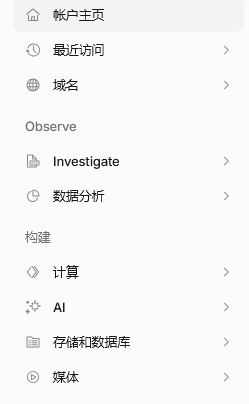
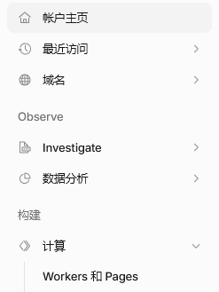
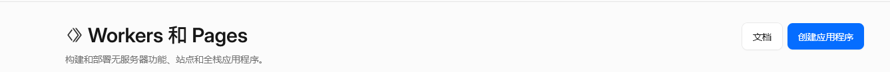
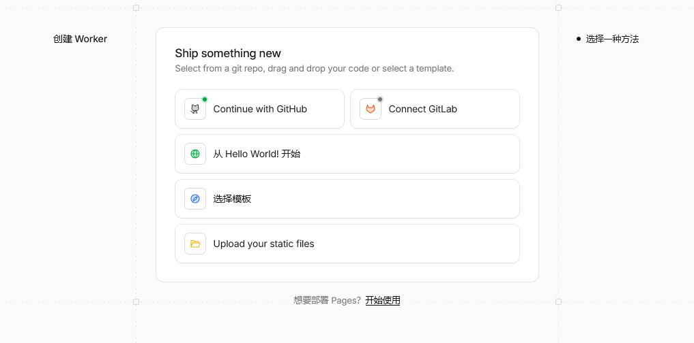
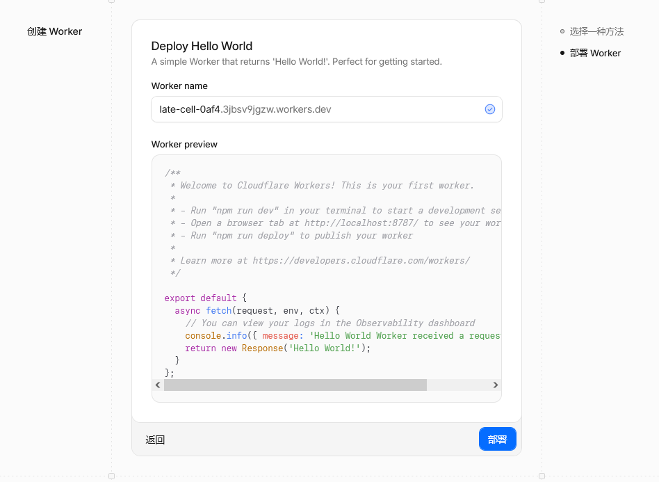
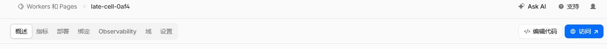
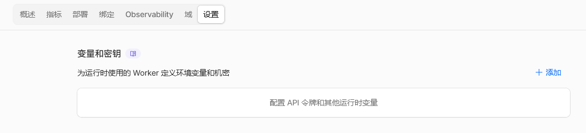
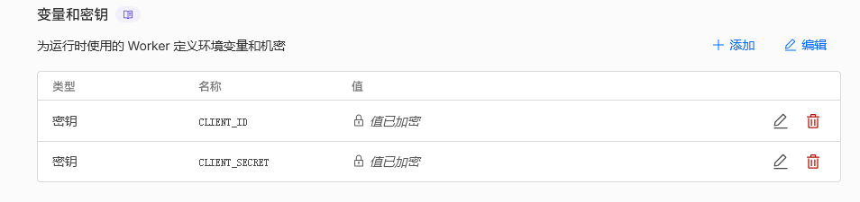
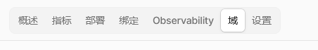

Cotalk 是一个基于 Codeberg Issues 与 Gitalk 的评论系统，本文旨在介绍如何在 Fuwari 博客中添加这个评论系统。

## 准备工作

你需要：

- 一个 Cloudflare 账户
- 一个 Codeberg 账户
- 一个正常运行的 Fuwari 博客
- ~~一个聪明的脑子~~
  
## 配置

### 准备 Codeberg 仓库

首先，我们需要在 Codeberg 上创建一个专门用于存储评论的仓库。这个仓库必须是公开的，因为 Cotalk 需要通过访问 Codeberg 仓库来加载和提交评论。

1. 创建新仓库

- 登录 Codeberg , 点击右上角 "+" 按钮

- 选择 "创建仓库"

- 填写仓库名称（如 `fuwari-comments`）和其他必要信息

- 确保仓库可见性设置为 Public

### 配置 Cotalk

接下来，我们需要配置 Cotalk 以将评论与我们的仓库关联起来。

1. 创建 Workers

打开 [Cloudflare 控制面板](https://dash.cloudflare.com)，并使用你的 Cloudflare 账户登录。

点击 "计算"。



点击 "Workers 和 Pages"。



点击 "创建应用程序"。



点击 "从 Hello World! 开始"。



点击 "部署"。



点击 "编辑代码"。



在打开的 Code Server 编辑器中填入以下代码。

```js
// Cloudflare Worker：CoTalk OAuth 安全代理
export default {
    async fetch(request, env) {
        const url = new URL(request.url);
        const blogOrigin = 'yourblogdomain'; // 你的博客域名

        // 封装 CORS 头部设置，避免遗漏
        const corsHeaders = {
            'Access-Control-Allow-Origin': blogOrigin,
            'Access-Control-Allow-Methods': 'GET, POST, OPTIONS',
            'Access-Control-Allow-Headers': 'Content-Type',
        };

        // CORS 预检
        if (request.method === 'OPTIONS') {
            return new Response(null, { headers: corsHeaders });
        }

        // ---------- 1. 授权请求：GET /authorize ----------
        if (request.method === 'GET' && url.pathname === '/authorize') {
            const clientId = url.searchParams.get('client_id');
            const redirectUri = url.searchParams.get('redirect_uri') || blogOrigin;
            const state = url.searchParams.get('state') || '';

            // 将前端回调地址和状态编码进 state
            const codebergState = JSON.stringify({
                redirect_uri: redirectUri,
                frontend_state: state,
            });

            const codebergAuthUrl = new URL('https://codeberg.org/login/oauth/authorize');
            codebergAuthUrl.searchParams.set('client_id', env.CLIENT_ID);
            codebergAuthUrl.searchParams.set('redirect_uri', `${url.origin}/callback`);
            codebergAuthUrl.searchParams.set('response_type', 'code');
            codebergAuthUrl.searchParams.set('state', codebergState);

            // ✅ 302 重定向务必带上 CORS 头
            return new Response(null, {
                status: 302,
                headers: {
                    ...corsHeaders,               // CORS 头
                    'Location': codebergAuthUrl.toString(),
                },
            });
        }

        // ---------- 2. 回调处理：GET /callback ----------
        if (request.method === 'GET' && url.pathname === '/callback') {
            const code = url.searchParams.get('code');
            const stateParam = url.searchParams.get('state');

            if (!code || !stateParam) {
                return new Response('Missing code or state', { status: 400, headers: corsHeaders });
            }

            let parsedState;
            try {
                parsedState = JSON.parse(stateParam);
            } catch {
                return new Response('Invalid state parameter', { status: 400, headers: corsHeaders });
            }

            const redirectUri = parsedState.redirect_uri || blogOrigin;
            const frontendState = parsedState.frontend_state || '';

            try {
                const tokenResponse = await fetch('https://codeberg.org/login/oauth/access_token', {
                    method: 'POST',
                    headers: { 'Content-Type': 'application/json', 'Accept': 'application/json' },
                    body: JSON.stringify({
                        client_id: env.CLIENT_ID,
                        client_secret: env.CLIENT_SECRET,
                        code,
                        grant_type: 'authorization_code',
                        redirect_uri: `${url.origin}/callback`,
                    }),
                });

                const tokenData = await tokenResponse.json().catch(() => null);

                if (!tokenData || tokenData.error) {
                    const errorRedirect = new URL(redirectUri);
                    errorRedirect.hash = `error=${tokenData?.error || 'unknown'}&error_description=${encodeURIComponent(tokenData?.error_description || 'Token exchange failed')}`;
                    return new Response(null, {
                        status: 302,
                        headers: { ...corsHeaders, 'Location': errorRedirect.toString() },
                    });
                }

                if (!tokenData.access_token) {
                    throw new Error('No access_token in response');
                }

                const frontendRedirect = new URL(redirectUri);
                const hashParams = new URLSearchParams();
                hashParams.set('access_token', tokenData.access_token);
                hashParams.set('token_type', tokenData.token_type || 'bearer');
                if (frontendState) hashParams.set('state', frontendState);
                frontendRedirect.hash = hashParams.toString();

                return new Response(null, {
                    status: 302,
                    headers: { ...corsHeaders, 'Location': frontendRedirect.toString() },
                });
            } catch (err) {
                const errorRedirect = new URL(redirectUri);
                errorRedirect.hash = `error=server_error&error_description=${encodeURIComponent(err.message)}`;
                return new Response(null, {
                    status: 302,
                    headers: { ...corsHeaders, 'Location': errorRedirect.toString() },
                });
            }
        }

        // ---------- 3. Token 交换：POST /access_token ----------
        if (request.method === 'POST' && url.pathname === '/access_token') {
            try {
                const { code } = await request.json();
                if (!code) {
                    return new Response(JSON.stringify({ error: 'Code missing' }), {
                        status: 400,
                        headers: { ...corsHeaders, 'Content-Type': 'application/json' },
                    });
                }

                const tokenResponse = await fetch('https://codeberg.org/login/oauth/access_token', {
                    method: 'POST',
                    headers: { 'Content-Type': 'application/json', 'Accept': 'application/json' },
                    body: JSON.stringify({
                        client_id: env.CLIENT_ID,
                        client_secret: env.CLIENT_SECRET,
                        code,
                        grant_type: 'authorization_code',
                        redirect_uri: `${url.origin}/callback`,
                    }),
                });

                const data = await tokenResponse.json().catch(() => ({ error: 'Invalid JSON' }));
                return new Response(JSON.stringify(data), {
                    status: data.error ? 400 : 200,
                    headers: { ...corsHeaders, 'Content-Type': 'application/json' },
                });
            } catch (err) {
                return new Response(JSON.stringify({ error: 'server_error' }), {
                    status: 500,
                    headers: { ...corsHeaders, 'Content-Type': 'application/json' },
                });
            }
        }

        return new Response('Not Found', { status: 404, headers: corsHeaders });
    },
};
```

将 `yourblogdomain` 字段替换为你的博客域名。

更改后，点击 "部署"。

1. 配置 OAuth

打开 [Codeberg OAuth 应用程序创建界面](https://codeberg.org/user/settings/applications)，创建一个 OAuth 应用，并记下 `客户端 ID` 与 `客户端密钥`。

回到 Cloudflare 控制面板，进入你刚刚创建的 Workers 应用。

点击 "设置"。



点击 "添加"。

添加一条密钥，名称为 `CLIENT_ID` ，内容为你刚刚创建的 OAuth 应用的 `客户端 ID`。

再添加一条密钥，名称为 `CLIENT_SECRET` ，内容为你刚刚创建的 OAuth 应用的 `客户端密钥`。

创建好后，长这样：



然后，点击 "域"。



记住下面的 "Worker URL"。

回到 Codeberg OAuth 应用程序创建界面，点击你刚才创建的 OAuth 应用，在 "重定向 URI" 一栏填入 `刚才的 Worker URL/callback` ，点击保存。

1. 获取配置信息

完成以上步骤后，记录以下配置信息，稍后将在 Fuwari 中使用：

- 仓库名称
- 客户端 ID
- Workers URL

### 添加到 Fuwari

1. 创建 Cotalk 组件

为了实现在亮色/暗色下都能使 Cotalk 完美显示,我们需要在 src/components/misc/ 目录下创建 Cotalk.astro 文件，内容如下：

```astro title="src/components/misc/Cotalk.astro"
---
// src/components/comment/Cotalk.astro
export interface Props {
  clientID: string;
  proxy: string;
  repo: string;
  owner: string;
  admin: string[];
  id?: string;
  number?: number;
  labels?: string[];
  title?: string;
  language?: string;
  perPage?: number;
  distractionFreeMode?: boolean;
  pagerDirection?: 'last' | 'first';
  createIssueManually?: boolean;
  enableHotKey?: boolean;
}

const {
  clientID,
  proxy,
  repo,
  owner,
  admin,
  id,
  number = -1,
  labels = ['Cotalk'],
  title = '',
  language = 'zh-CN',
  perPage = 10,
  distractionFreeMode = false,
  pagerDirection = 'last',
  createIssueManually = false,
  enableHotKey = true,
} = Astro.props;

// 提前构建配置对象，确保所有解构变量都被使用
const config = {
  clientID,
  proxy,
  repo,
  owner,
  admin,
  id: id || null,
  number,
  labels,
  title: title || null,
  language,
  perPage,
  distractionFreeMode,
  pagerDirection,
  createIssueManually,
  enableHotKey,
};

// 序列化一次，供模板使用
const configJSON = JSON.stringify(config);
---

<div id="cotalk-container" class="cotalk-root"></div>

<!-- 直接输出 JSON，使用 set:html 避免 HTML 转义 -->
<script type="application/json" id="cotalk-config" set:html={configJSON}></script>

<!-- 加载 CoTalk CSS（只加载一次） -->
<script>
  if (!document.querySelector('link[href*="cotalk.css"]')) {
    const link = document.createElement('link');
    link.rel = 'stylesheet';
    link.href = 'https://unpkg.com/@clina_z/cotalk@latest/dist/cotalk.css';
    document.head.appendChild(link);
  }
</script>

<!-- 核心初始化脚本 -->
<script>
  // 声明全局变量 Cotalk，避免 TypeScript 报错
  declare var Cotalk: any;

  (function () {
    function getConfig() {
      const configEl = document.getElementById('cotalk-config');
      if (!configEl) return null;
      try {
        return JSON.parse(configEl.textContent);
      } catch (e) {
        console.error('解析 CoTalk 配置失败', e);
        return null;
      }
    }

    function loadCotalkScript(): Promise<void> {
      return new Promise<void>((resolve, reject) => {
        if ((window as any).Cotalk) return resolve();
        const script = document.createElement('script');
        script.src = 'https://unpkg.com/@clina_z/cotalk@latest/dist/cotalk.min.js';
        script.onload = () => {
          if ((window as any).Cotalk) resolve();
          else reject(new Error('Cotalk 全局变量未暴露'));
        };
        script.onerror = () => reject(new Error('Cotalk 脚本加载失败'));
        document.head.appendChild(script);
      });
    }

    async function initCotalk(): Promise<void> {
      try {
        const config = getConfig();
        if (!config) return;

        await loadCotalkScript();
        const container = document.getElementById('cotalk-container');
        if (!container) return;

        // 清空容器（为 SWUP 切换页面做准备）
        container.innerHTML = '';

        const finalId = config.id || window.location.pathname;
        const finalTitle = config.title || document.title;

        const cotalk = new Cotalk({
          clientID: config.clientID,
          proxy: config.proxy,
          repo: config.repo,
          owner: config.owner,
          admin: config.admin,
          id: finalId,
          number: config.number,
          labels: config.labels,
          title: finalTitle,
          language: config.language,
          perPage: config.perPage,
          distractionFreeMode: config.distractionFreeMode,
          pagerDirection: config.pagerDirection,
          createIssueManually: config.createIssueManually,
          enableHotKey: config.enableHotKey,
        });

        cotalk.render(container);
      } catch (e) {
        console.error('CoTalk 初始化失败:', e);
      }
    }

    // 首次加载
    initCotalk();

    // SWUP 无刷新页面切换
    if (window.swup) {
      window.swup.hooks.on('page:view', initCotalk);
      document.addEventListener('swup:contentReplaced', initCotalk);
    }

    // 主题切换时重新渲染
    const observer = new MutationObserver((mutations) => {
      for (const mutation of mutations) {
        if (mutation.type === 'attributes' && mutation.attributeName === 'class') {
          initCotalk();
          break;
        }
      }
    });
    observer.observe(document.documentElement, {
      attributes: true,
      attributeFilter: ['class'],
    });
  })();
</script>

<style is:global>
  #cotalk-container {
    width: 100%;
    margin-top: 2rem;
  }
</style>
```

接下来，在 `src/pages/posts/[...slug].astro` 中引入 Cotalk：

``` diff lang="astro" title="src/pages/posts/[...slug].astro"
---
import path from "node:path";
import { render } from "astro:content";
import License from "@components/misc/License.astro";
import Markdown from "@components/misc/Markdown.astro";
+import Cotalk from "../../components/misc/Cotalk.astro";
import BlogInvitationCard from '@components/BlogInvitationCard.astro';
import I18nKey from "@i18n/i18nKey";
```

然后在许可证组件之后添加 Cotalk 组件：

``` diff lang="astro" title="src/pages/posts/[...slug].astro"
   {licenseConfig.enable && <License title={entry.data.title} slug={entry.id} pubDate={entry.data.published} class="mb-6 rounded-xl license-container onload-animation"></License>}


+   <Cotalk
+    clientID="yourclientid"
+    proxy="yourworkerurl"
+    repo="repo"
+    owner="yourusername"
+    admin={['yourusername']}
+    id={Astro.url.pathname}
+    language="zh-CN"
+    />
+  </div>
+ </div>

 <div class="flex flex-col md:flex-row justify-between mb-4 gap-4 overflow-hidden w-full">
  <a href={entry.data.nextSlug ? getPostUrlBySlug(entry.data.nextSlug) : "#"}
   class:list={["w-full font-bold overflow-hidden active:scale-95", {"pointer-events-none": !entry.data.nextSlug}]}>
   {entry.data.nextSlug && <div class="btn-card rounded-2xl w-full h-[3.75rem] max-w-full px-4 flex items-center !justify-start gap-4" >
    <Icon name="material-symbols:chevron-left-rounded" class="text-[2rem] text-[var(--primary)]" />
    <div class="overflow-hidden transition overflow-ellipsis whitespace-nowrap max-w-[calc(100%_-_3rem)] text-black/75 dark:text-white/75">
     {entry.data.nextTitle}
    </div>
   </div>}
  </a>
```

保存文件后重新构建项目即可看到评论区。

通过以上步骤，你就成功为 Fuwari 添加了功能完善的评论系统！
